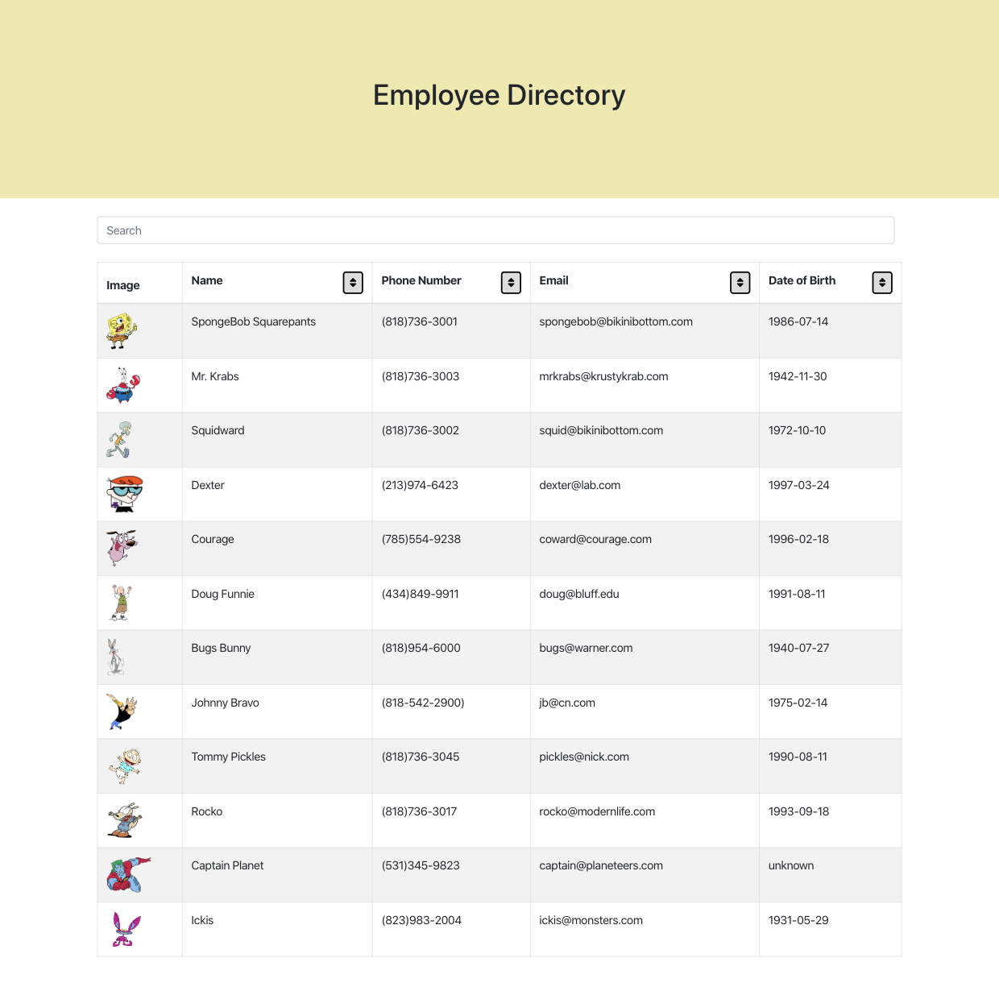

# React Employee Directory
As a user, I want to be able to view my entire employee directory at once so that I have quick access to their information.

[View the deployed site here](https://employee-directory-0.herokuapp.com/)

## About
This Employee Directory app is built to allow `json` data to be passed to the app and list each employee and the required information on to the page. 

Use the search bar at the top of the page to search through the employee's names and emails.

Use the sort buttons next to the desired column to sort the list into Ascending order.

## Getting Started: Locally
To run this app locally, be sure to `npm install` first.

Open the root directory in your desired terminal and run `npm start` to launch the app.

### Built With
* React.js
* Node.js
* JSX
* Bootstrap